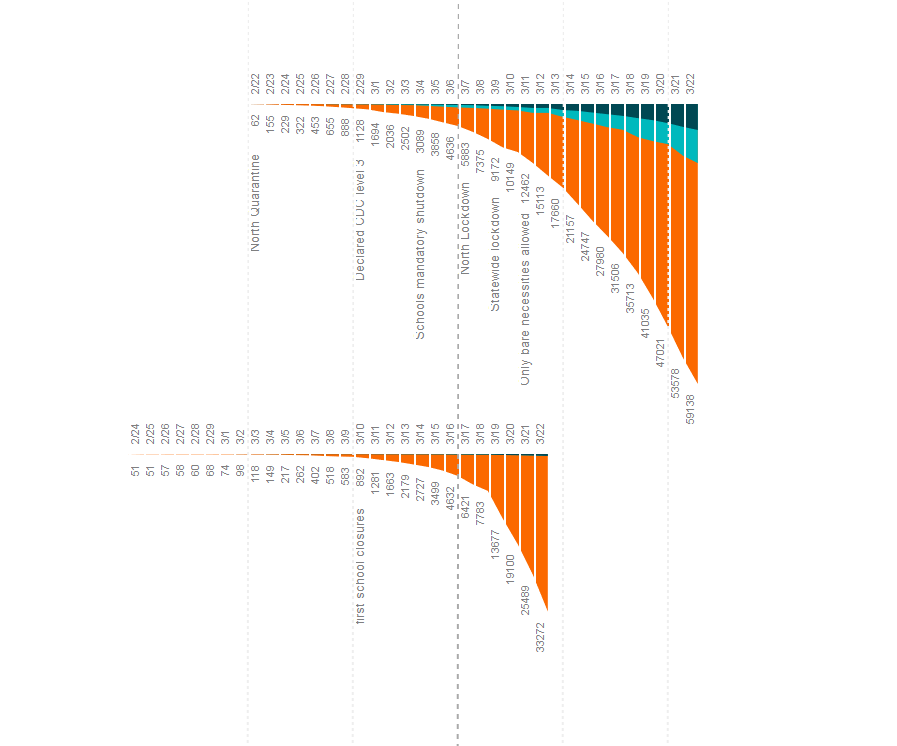

# Comparing outbreaks
Time series of countries affected by covid aligned by number of infected people rather than by date.

Move the slider on top to change the value used for the alignment.

Use the toggles at the top to change scale and views.

Data sources:
- [CSSEGISandData](https://github.com/CSSEGISandData/COVID-19)
- [Italian Protezione Civile](https://github.com/pcm-dpc/COVID-19)
